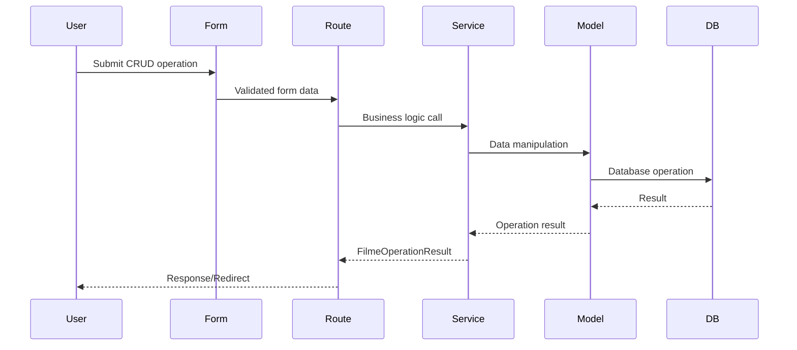

# Design Document

## Overview

The Filme CRUD Management feature extends the existing MyMovieDB system to provide comprehensive Create, Read, Update, Delete operations for movie records. The design follows the established Flask application patterns including Blueprint organization, service layer architecture, and Flask-WTF form handling. The feature integrates with the existing Genero autocomplete API to provide an intuitive genre selection interface.

## Architecture

### Component Overview

The feature follows the existing layered architecture:

```
┌─────────────────┐    ┌─────────────────┐    ┌─────────────────┐
│   Web Routes    │    │   API Routes    │    │   Templates     │
│   (filme_bp)    │    │   (api_bp)      │    │   (Jinja2)      │
└─────────────────┘    └─────────────────┘    └─────────────────┘
         │                       │                       │
         └───────────────────────┼───────────────────────┘
                                 │
┌─────────────────────────────────┼─────────────────────────────────┐
│                    Service Layer                                  │
│  ┌─────────────────┐    ┌─────────────────┐    ┌──────────────┐ │
│  │  FilmeCrudService│    │  FilmeService   │    │ Other Services│ │
│  └─────────────────┘    └─────────────────┘    └──────────────┘ │
└─────────────────────────────────┼─────────────────────────────────┘
                                 │
┌─────────────────────────────────┼─────────────────────────────────┐
│                     Data Layer                                    │
│  ┌─────────────────┐    ┌─────────────────┐    ┌──────────────┐ │
│  │     Filme       │    │     Genero      │    │ FilmeGenero  │ │
│  │    (Model)      │    │    (Model)      │    │  (Junction)  │ │
│  └─────────────────┘    └─────────────────┘    └──────────────┘ │
└─────────────────────────────────────────────────────────────────┘
```

### Integration Points

- **Existing API**: Leverages `/api/generos/search` for autocomplete functionality
- **Existing Models**: Uses current Filme, Genero, and FilmeGenero models
- **Existing Services**: Extends FilmeService and integrates with ImageProcessingService
- **Existing Infrastructure**: Uses established Flask-WTF, SQLAlchemy, and Blueprint patterns

## Components and Interfaces

### 1. Forms Layer (`app/forms/filmes/`)

#### FilmeCrudForm
Primary form for create and edit operations:

```python
class FilmeCrudForm(FlaskForm):
    # Basic movie information
    titulo_original = StringField(required=True, max_length=180)
    titulo_portugues = StringField(optional=True, max_length=180)
    ano_lancamento = IntegerField(optional=True, range=1800-2035)
    lancado = BooleanField(default=False)
    duracao_minutos = IntegerField(optional=True, min=1)
    sinopse = TextAreaField(optional=True)
    
    # Financial information
    orcamento_milhares = DecimalField(optional=True, min=0)
    faturamento_lancamento_milhares = DecimalField(optional=True, min=0)
    
    # Media information
    poster = FileField(optional=True, file_types=['image/*'])
    trailer_youtube = StringField(optional=True, youtube_url_validation)
    
    # Genre selection (handled via JavaScript)
    generos_selecionados = HiddenField()  # JSON array of genre IDs
```

The Genre selection MUST have a fallback alterantive for non-JavaScript browsers.

#### FilmeDeleteForm
Confirmation form for delete operations:

```python
class FilmeDeleteForm(FlaskForm):
    filme_id = HiddenField(validators=[CampoImutavel('id')])
    confirm_title = StringField(required=True)  # User must type movie title
```

### 2. Service Layer (`app/services/`)

#### FilmeCrudService
New service class following the established service pattern:

```python
class FilmeCrudService:
    """Service for Filme CRUD operations following established patterns."""
    
    @classmethod
    def create_filme(cls, form_data: dict, session=None) -> FilmeOperationResult
    
    @classmethod
    def update_filme(cls, filme_id: UUID, form_data: dict, session=None) -> FilmeOperationResult
    
    @classmethod
    def delete_filme(cls, filme_id: UUID, session=None) -> FilmeOperationResult
    
    @classmethod
    def get_filme_for_edit(cls, filme_id: UUID, session=None) -> Optional[Filme]
    
    @classmethod
    def update_filme_generos(cls, filme: Filme, genero_ids: list[UUID], session=None)
```

#### FilmeOperationResult
Result object for service operations:

```python
@dataclass
class FilmeOperationResult:
    success: bool
    message: str
    filme: Optional[Filme] = None
    errors: Optional[dict] = None
```

### 3. Routes Layer (`app/routes/filmes/`)

#### New CRUD Routes
Extending the existing filme_bp blueprint:

```python
# Create operations
@filme_bp.route('/create', methods=['GET', 'POST'])
@login_required
def create_filme()

# Edit operations  
@filme_bp.route('/<uuid:filme_id>/edit', methods=['GET', 'POST'])
@login_required
def edit_filme(filme_id)

# Delete operations
@filme_bp.route('/<uuid:filme_id>/delete', methods=['GET', 'POST'])
@login_required
def delete_filme(filme_id)
```

### 4. Template Layer (`app/routes/filmes/templates/filme/web/`)

#### Template Structure
```
app/routes/filmes/templates/filme/web/
├── create.jinja2
├── details.jinja2
├── edit.jinja2
└── delete.jinja2

app/templates/
├── details.jinja2        # Existing detail view (enhanced)
└── lista.jinja2          # Existing list view (enhanced)
```

#### Key Template Features
- **Responsive Bootstrap 5 forms** following existing UI patterns
- **Genre autocomplete widget** with badge display and removal
- **Image upload with preview** using existing Cropper.js integration and keeping 2:3 aspect ratio
- **Form validation feedback** with client-side and server-side validation
- **Navigation breadcrumbs** you MUST NOT add creadcrumb navigation

### 5. Frontend JavaScript Components

#### GenreAutocomplete Widget
```javascript
class GenreAutocomplete {
    constructor(inputElement, hiddenElement, badgeContainer)
    
    // Methods
    initializeAutocomplete()    // Setup autocomplete behavior
    addGenreBadge(genre)       // Add selected genre as badge
    removeGenreBadge(genreId)  // Remove genre badge
    updateHiddenField()        // Sync with form submission
}
```

## Data Models

### Existing Models (No Changes Required)

The design leverages existing models without modifications:

- **Filme**: Contains all required attributes for CRUD operations
- **Genero**: Provides genre data for autocomplete
- **FilmeGenero**: Junction table for many-to-many relationship

### Data Flow



## Error Handling

### Validation Strategy

1. **Client-side validation**: JavaScript for immediate feedback
2. **Form validation**: Flask-WTF validators for data integrity
3. **Service validation**: Business logic validation in service layer

### Error Response Patterns

```python
# Service layer error handling
try:
    # Database operations
    session.commit()
    return FilmeOperationResult(success=True, message="Success", filme=filme)
except SQLAlchemyError as e:
    session.rollback()
    return FilmeOperationResult(success=False, message="Database error", errors={'db': str(e)})
except ValidationError as e:
    return FilmeOperationResult(success=False, message="Validation failed", errors=e.errors)
```

### User Experience

- **Flash messages** for operation feedback
- **Form field highlighting** for validation errors
- **Graceful degradation** when JavaScript is disabled
- **Confirmation dialogs** for destructive operations

## Testing Strategy

### Unit Tests

1. **Form validation tests**: Test all form validators and edge cases
2. **Service layer tests**: Test CRUD operations with mocked database
3. **Model tests**: Test data integrity and relationships
4. **API endpoint tests**: Test genre autocomplete functionality

### Integration Tests

1. **Full CRUD workflow tests**: End-to-end operation testing
2. **Genre association tests**: Test autocomplete and badge functionality
3. **File upload tests**: Test poster upload and processing
4. **Permission tests**: Test authentication and authorization

### Test Data Strategy

- **Factory pattern**: Use existing test fixtures and factories
- **Database isolation**: Each test uses clean database state
- **Mock external services**: Mock image processing and file operations

## Security Considerations

### Authentication & Authorization

- **Login required**: All CRUD operations require authentication
- **Permission validation**: Verify user permissions for each operation
- **CSRF protection**: Flask-WTF provides automatic CSRF tokens via form.csrf_token()

### Data Validation

- **Input sanitization**: All user input validated and sanitized
- **File upload security**: Image validation using existing ImageProcessingService and constants
- **SQL injection prevention**: SQLAlchemy parameterized queries

### Error Information Disclosure

- **Generic error messages**: Avoid exposing internal system details
- **Logging**: Detailed errors logged for debugging without user exposure
- **Rate limiting**: Consider implementing for API endpoints

## Performance Considerations

### Database Optimization

- **Efficient queries**: Use existing model relationships and eager loading
- **Index utilization**: Leverage existing database indexes
- **Batch operations**: Optimize genre association updates

### Frontend Performance

- **Autocomplete debouncing**: Limit API calls during typing
- **Image optimization**: Use existing image processing pipeline
- **Progressive enhancement**: Core functionality works without JavaScript

### Caching Strategy

- **Genre data caching**: Cache frequently accessed genre lists
- **Static asset caching**: Leverage existing Flask static file handling
- **Database query optimization**: Use existing service layer patterns